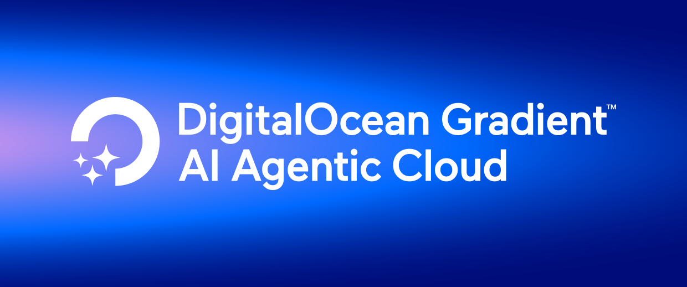

# 🚀 Gradient Platform Agent Templates
**Welcome, builder! 👋**

Ready to bring your AI agent ideas to life? You're in the right place!

This repository offers easy-to-use templates designed to help you launch powerful AI agents on DigitalOcean's Gradient Platform in just a few minutes. Think of this as your personal launchpad: simply clone a template, tweak a few settings, and deploy your agent directly to the cloud. You can pick from:
- **[LLM Auditor Agent](llm-auditor)**: Acts as a fact checking layer that searches the internet using the [Tavily API](https://www.tavily.com/) and optionally uses grounding data from a knowledge base to help improve the reliability of an existing agent.
- **[Product Documentation Agent](pdocs-agent)**: Answers questions from your customers about your products based on documentation.
- **[SQL Agent](sql-agent)**: Connects to your existing MySQL database and translates natural language questions into SQL queries, then analyzes the results. The agent dynamically fetches your database schema to craft intelligent queries and is restricted to read-only operations for security.
- **[Twilio API Agent](twilio-api-agent)**: Generates and sends marketing text messages to your customers using [Twilio](https://www.twilio.com/).

Whether you're building your first chatbot or a complex autonomous system, these templates handle the heavy lifting so you can focus on what makes your agent unique.

**Let's get building! 🛠️**

## Setup
Each folder is a separate agent template, with its own requirements file. Consult the individual READMEs for more information. 

