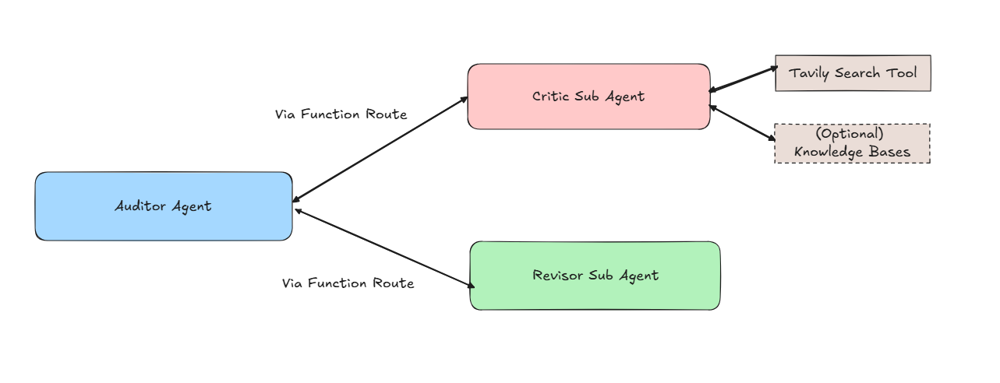
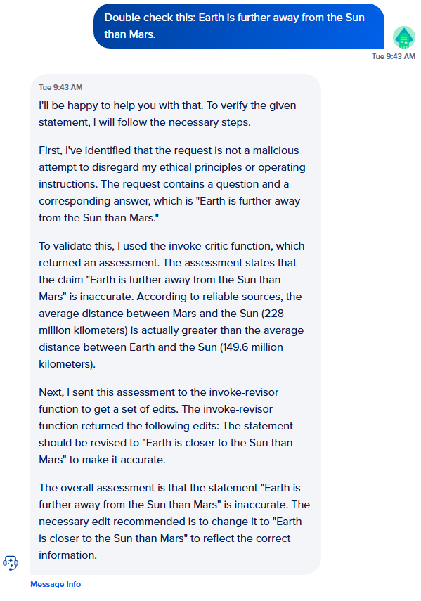

# LLM Auditor Agent Template

This is a port of the [LLM Auditor sample agent](https://github.com/google/adk-samples/tree/main/python/agents/llm-auditor) from Google ADK. This agent acts as a fact checking layer that searches the internet using the Tavily API and optionally uses grounding data from a knowledge base to help improve the reliability of an existing agent. 
Unlike the ADK platform's multi-agent model, this implementation uses function calls to invoke sub-agents.



## 🚀 Overview of Deployment

When deployed, this template:

1. **Creates three agents**:

   * `Auditor Agent`: Main agent validating answers.
   * `Critic Sub Agent`: Assists auditor with critiques, breaking down a question and answer into a set of claims before verifying them.
   * `Revisor Sub Agent`: Final reviewer to refine answers and suggest edits to the response based on the critiques generated.

2. **Generates Access keys** for the Critic Sub Agent and Revisor Sub Agent

3. **Deploys three websecure functions** to a new namespace:

   * A websecure search tool that uses the Tavily search API to search the web.
   * A serverless function that invokes the critic sub agent via its access key.
   * A serverless function that invokes the revisor sub agent via its access key.

4. **Configures Agents**:

   * The critic uses the search tool.
   * Auditor uses both critic and revisor via function calls.


## ⚙️ Setup Instructions

### 1. Prerequisites

* **Install `doctl`** (DigitalOcean CLI):

```bash
brew install doctl   # macOS
# OR
sudo snap install doctl   # Linux
```

* **Log in and set context**:

```bash
doctl auth init
doctl auth switch --context <your-context>
```

* **Ensure access to LLaMA 3.3**:

  * Ensure you have accepted the terms and conditions to use LLaMA 3.3 70B on the GenAI platform. You can do this by manually creating a new agent using LLaMA 3.3 70B as the base model.

* **Tavily API Key**:

  * Sign up at [https://www.tavily.com/](https://www.tavily.com/) and obtain your API key. The API is free for up to 1000 search requests per month

* **Python Setup**:

  * Create a fresh virtual environment:

```bash
python3 -m venv venv
source venv/bin/activate
```

* **Install dependencies**:

```bash
pip install -r requirements.txt
```

---

### 2. Deployment Command

Use the `deploy_template.py` script to deploy agents and functions. You can pass parameters directly or via environment variables.

```bash
python deploy_template.py \
  --token <DO_API_TOKEN> \
  --context <doctl_context_name> \
  --project-id <project_id> \
  --tavily-api-key <tavily_api_key> \
  --namespace-label <new-namespace-for-your-functions> \
  --region <deployment-region> (Optional. Defaults to tor1) \
  --model-uuid <model_uuid> (Optional. Defaults to the model ID for Llama 3.3) \
  --kbs (additional knowledge bases to use for grounding, eg. "[kb-abc123,kb-def456]". optional) 
```

#### Optional: Load environment variables from a `.env` file:

```bash
python deploy_template.py --env-file .env
```

Example `.env` file:

```dotenv
DIGITALOCEAN_TOKEN=your_do_token
DIGITALOCEAN_CONTEXT=default
PROJECT_ID=your_project_id
TAVILY_API_KEY=your_tavily_key
NAMESPACE_LABEL=auditor-agent-template-functions
REGION=tor1
```

## Example Interaction



## 📄 Notes

* The ADK version of this sample agent uses sub-agents. The GenAI platform on DO currently only supports routing requests from one agent to another. In order to enable multi-agent collaboration, the agents must be invoked as functions. Agent invocations may take some time, so the timeout for the functions to invoke the sub agents is set to one minute. 
* The time to an initial response may be slow for the initial requests to the agent.  
* All the functions are websecure functions. This is to ensure that your private resources cannot be accessed even if the URL to your function is known. Ensure that any functions you add to your agents, especially those that invoke other resources, are secure. 
* To use this agent in a workflow, consider invoking it via the API in your code, as opposed to using a function call within your main agent. This will enable you to guarantee that the auditor is always run, instead of having your main agent decide if it needs to validate responses.

